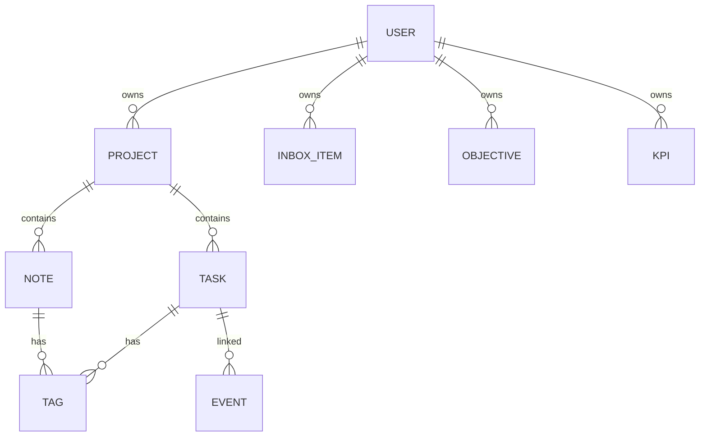

# 🗄️ DATA_MODEL.md — Modèle de Données V1

> Architecture des données pour TableauDeBord (PARA + GTD)

---

## 📊 Vue d'ensemble

---

## 📦 Entités

### 1. User

| Champ | Type | Description |
|-------|------|-------------|
| `id` | UUID | Identifiant unique |
| `email` | String | Email (unique) |
| `password_hash` | String | Mot de passe hashé |
| `name` | String | Nom d'affichage |
| `avatar_url` | String? | URL avatar |
| `settings` | JSON | Préférences utilisateur |
| `created_at` | DateTime | Date création |
| `updated_at` | DateTime | Date modification |

---

### 2. Project (PARA)

| Champ | Type | Description |
|-------|------|-------------|
| `id` | UUID | Identifiant unique |
| `user_id` | UUID | FK → User |
| `name` | String | Nom du projet |
| `description` | String? | Description |
| `category` | Enum | `PROJECT` \| `AREA` \| `RESOURCE` \| `ARCHIVE` |
| `color` | String | Code couleur hex |
| `icon` | String? | Emoji ou icône |
| `status` | Enum | `ACTIVE` \| `ON_HOLD` \| `COMPLETED` \| `ARCHIVED` |
| `created_at` | DateTime | Date création |
| `updated_at` | DateTime | Date modification |

---

### 3. Task

| Champ | Type | Description |
|-------|------|-------------|
| `id` | UUID | Identifiant unique |
| `project_id` | UUID? | FK → Project (nullable pour inbox) |
| `user_id` | UUID | FK → User |
| `title` | String | Titre de la tâche |
| `description` | String? | Description détaillée |
| `status` | Enum | `TODO` \| `IN_PROGRESS` \| `BLOCKED` \| `DONE` |
| `priority` | Enum | `LOW` \| `MEDIUM` \| `HIGH` \| `URGENT` |
| `due_date` | Date? | Date d'échéance |
| `is_today` | Boolean | Flag "Today" GTD |
| `estimated_minutes` | Int? | Estimation durée |
| `completed_at` | DateTime? | Date complétion |
| `order` | Int | Ordre d'affichage |
| `created_at` | DateTime | Date création |
| `updated_at` | DateTime | Date modification |

---

### 4. Inbox Item

| Champ | Type | Description |
|-------|------|-------------|
| `id` | UUID | Identifiant unique |
| `user_id` | UUID | FK → User |
| `content` | String | Contenu texte libre |
| `processed` | Boolean | Traité ou non |
| `processed_at` | DateTime? | Date traitement |
| `converted_to` | Enum? | `TASK` \| `NOTE` \| `ARCHIVED` |
| `converted_id` | UUID? | ID de l'élément créé |
| `created_at` | DateTime | Date création |

---

### 5. Note

| Champ | Type | Description |
|-------|------|-------------|
| `id` | UUID | Identifiant unique |
| `user_id` | UUID | FK → User |
| `project_id` | UUID? | FK → Project |
| `title` | String | Titre |
| `content` | Text | Contenu Markdown |
| `is_pinned` | Boolean | Épinglé en haut |
| `created_at` | DateTime | Date création |
| `updated_at` | DateTime | Date modification |

---

### 6. Tag

| Champ | Type | Description |
|-------|------|-------------|
| `id` | UUID | Identifiant unique |
| `user_id` | UUID | FK → User |
| `name` | String | Nom du tag |
| `color` | String | Code couleur hex |

#### Task_Tag (junction)

| Champ | Type |
|-------|------|
| `task_id` | UUID |
| `tag_id` | UUID |

#### Note_Tag (junction)

| Champ | Type |
|-------|------|
| `note_id` | UUID |
| `tag_id` | UUID |

---

### 7. Event (Calendar)

| Champ | Type | Description |
|-------|------|-------------|
| `id` | UUID | Identifiant unique |
| `user_id` | UUID | FK → User |
| `task_id` | UUID? | FK → Task (optionnel) |
| `title` | String | Titre |
| `description` | String? | Description |
| `start_at` | DateTime | Début |
| `end_at` | DateTime | Fin |
| `all_day` | Boolean | Journée entière |
| `recurrence` | JSON? | Règle récurrence |
| `created_at` | DateTime | Date création |
| `updated_at` | DateTime | Date modification |

---

### 8. Objective (Business)

| Champ | Type | Description |
|-------|------|-------------|
| `id` | UUID | Identifiant unique |
| `user_id` | UUID | FK → User |
| `name` | String | Nom de l'objectif |
| `description` | String? | Description |
| `target_value` | Decimal | Valeur cible |
| `current_value` | Decimal | Valeur actuelle |
| `unit` | String | Unité (€, %, etc.) |
| `deadline` | Date? | Date limite |
| `created_at` | DateTime | Date création |
| `updated_at` | DateTime | Date modification |

---

### 9. KPI (Business)

| Champ | Type | Description |
|-------|------|-------------|
| `id` | UUID | Identifiant unique |
| `user_id` | UUID | FK → User |
| `name` | String | Nom du KPI |
| `value` | Decimal | Valeur actuelle |
| `unit` | String | Unité |
| `trend` | Enum | `UP` \| `DOWN` \| `STABLE` |
| `recorded_at` | DateTime | Date enregistrement |

---

## 🔗 Références

- [SPEC.md](SPEC.md) — Spécifications
- [UI_MAP.md](UI_MAP.md) — Cartographie UI
