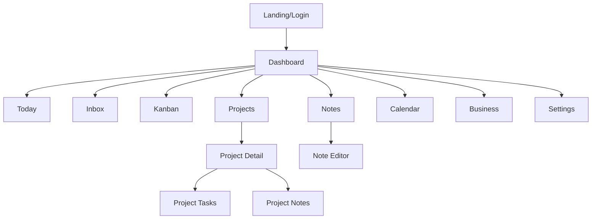

# 🗺️ UI_MAP.md — Cartographie UI/UX V1

> Navigation et structure des interfaces TableauDeBord

---

## 📍 Sitemap



---

## 🧭 Navigation Principale

```
┌─────────────────────────────────────────────────────────┐
│  🎯 TableauDeBord          [Search]     [+] [🔔] [👤]  │
├────────────┬────────────────────────────────────────────┤
│            │                                            │
│  📅 Today  │                                            │
│  📥 Inbox  │          MAIN CONTENT AREA                 │
│  📊 Kanban │                                            │
│  📁 Projects                                            │
│  📝 Notes  │                                            │
│  🗓️ Calendar                                            │
│  💼 Business                                            │
│            │                                            │
│  ──────────│                                            │
│  ⚙️ Settings                                            │
│            │                                            │
└────────────┴────────────────────────────────────────────┘
```

---

## 📱 Pages — Wireframes

### 1. Today View

```
┌─────────────────────────────────────────┐
│ 📅 Today                    Jan 19, 2026│
├─────────────────────────────────────────┤
│ Progress: ████████░░ 80% (4/5 tasks)    │
├─────────────────────────────────────────┤
│ ☐ Review pull request #42         🔴 H │
│ ☑ Write SPEC documentation        ✓    │
│ ☑ Update data model              ✓    │
│ ☐ Deploy to staging              🟡 M │
│ ☑ Team standup                   ✓    │
├─────────────────────────────────────────┤
│ [+ Add to Today]                        │
└─────────────────────────────────────────┘
```

---

### 2. Inbox

```
┌─────────────────────────────────────────┐
│ 📥 Inbox                      3 items   │
├─────────────────────────────────────────┤
│ ┌─────────────────────────────────────┐ │
│ │ Quick capture... [Enter to add]    │ │
│ └─────────────────────────────────────┘ │
├─────────────────────────────────────────┤
│ ○ Idée: nouveau feature calendar sync  │
│   [→ Task] [📝 Note] [🗑️]              │
│ ─────────────────────────────────────── │
│ ○ Rappel: contacter client XYZ          │
│   [→ Task] [📝 Note] [🗑️]              │
│ ─────────────────────────────────────── │
│ ○ Article à lire sur productivité       │
│   [→ Task] [📝 Note] [🗑️]              │
└─────────────────────────────────────────┘
```

---

### 3. Kanban

```
┌──────────────────────────────────────────────────────────────────┐
│ 📊 Kanban    [Filter: All Projects ▼]  [Tags ▼]                  │
├───────────────┬───────────────┬───────────────┬──────────────────┤
│ TO DO (5)     │ IN PROGRESS(2)│ BLOCKED (1)   │ DONE (12)        │
├───────────────┼───────────────┼───────────────┼──────────────────┤
│ ┌───────────┐ │ ┌───────────┐ │ ┌───────────┐ │ ┌──────────────┐ │
│ │ Task A    │ │ │ Task D    │ │ │ Task F    │ │ │ Task G  ✓    │ │
│ │ 🔴 High   │ │ │ 🟡 Med    │ │ │ ⚠️ Client │ │ │ Completed    │ │
│ │ Due: Today│ │ │ @ProjectX │ │ │ waiting   │ │ │ yesterday    │ │
│ └───────────┘ │ └───────────┘ │ └───────────┘ │ └──────────────┘ │
│ ┌───────────┐ │ ┌───────────┐ │               │ ┌──────────────┐ │
│ │ Task B    │ │ │ Task E    │ │               │ │ Task H  ✓    │ │
│ └───────────┘ │ └───────────┘ │               │ └──────────────┘ │
│ ┌───────────┐ │               │               │                  │
│ │ Task C    │ │               │               │                  │
│ └───────────┘ │               │               │                  │
│ [+ Add Task]  │               │               │                  │
└───────────────┴───────────────┴───────────────┴──────────────────┘
```

---

### 4. Projects

```
┌─────────────────────────────────────────────────────────┐
│ 📁 Projects    [+ New Project]                          │
├─────────────────────────────────────────────────────────┤
│ [All] [Projects] [Areas] [Resources] [Archives]         │
├─────────────────────────────────────────────────────────┤
│ ┌─────────────────────┐ ┌─────────────────────┐         │
│ │ 🟢 TableauDeBord    │ │ 🔵 Client ABC       │         │
│ │ PROJECT             │ │ PROJECT             │         │
│ │ ████████░░ 80%      │ │ ██████░░░░ 60%      │         │
│ │ 8/10 tasks          │ │ 6/10 tasks          │         │
│ └─────────────────────┘ └─────────────────────┘         │
│ ┌─────────────────────┐ ┌─────────────────────┐         │
│ │ 🟣 Marketing        │ │ 📚 Learning         │         │
│ │ AREA                │ │ RESOURCE            │         │
│ │ Ongoing             │ │ Reference           │         │
│ └─────────────────────┘ └─────────────────────┘         │
└─────────────────────────────────────────────────────────┘
```

---

### 5. Notes

```
┌─────────────────────────────────────────────────────────┐
│ 📝 Notes    [+ New Note]    🔍 Search notes...          │
├──────────────────┬──────────────────────────────────────┤
│ Recent Notes     │ # Meeting Notes - Client ABC        │
│ ──────────────── │ ──────────────────────────────────── │
│ > Meeting Notes  │ **Date:** 2026-01-19                │
│   Client ABC     │ **Attendees:** John, Marie          │
│   📁 Client ABC  │                                      │
│ ──────────────── │ ## Action Items                      │
│ > Architecture   │ - [ ] Send proposal                  │
│   decisions      │ - [ ] Schedule follow-up             │
│   📁 TableauDeBord                                      │
│ ──────────────── │ ## Notes                             │
│ > Weekly review  │ Client interested in...              │
│   template       │                                      │
│   No project     │ [Edit] [Delete] [Link to Project]   │
└──────────────────┴──────────────────────────────────────┘
```

---

### 6. Calendar

```
┌─────────────────────────────────────────────────────────┐
│ 🗓️ Calendar    [< Prev] January 2026 [Next >]   [M|W|D]│
├─────────────────────────────────────────────────────────┤
│ Mon    Tue    Wed    Thu    Fri    Sat    Sun          │
│ ─────────────────────────────────────────────────────── │
│   1      2      3      4      5      6      7          │
│                              🔵                         │
│ ─────────────────────────────────────────────────────── │
│   8      9     10     11     12     13     14          │
│                🔴                                       │
│ ─────────────────────────────────────────────────────── │
│  15     16     17     18    [19]    20     21          │
│                             🔴🟡                        │
│ ─────────────────────────────────────────────────────── │
│  22     23     24     25     26     27     28          │
│  🔵                                                     │
└─────────────────────────────────────────────────────────┘
```

---

### 7. Business

```
┌─────────────────────────────────────────────────────────┐
│ 💼 Business Dashboard                    January 2026   │
├─────────────────────────────────────────────────────────┤
│ ┌─────────────┐ ┌─────────────┐ ┌─────────────┐         │
│ │ Revenue     │ │ Clients     │ │ Tasks Done  │         │
│ │ €12,500     │ │ 8           │ │ 45          │         │
│ │ ↑ +12%      │ │ ↑ +2        │ │ ↑ +15%      │         │
│ └─────────────┘ └─────────────┘ └─────────────┘         │
├─────────────────────────────────────────────────────────┤
│ Objectives                                              │
│ ─────────────────────────────────────────────────────── │
│ Q1 Revenue €50k   ████████░░░░░░ 50%                   │
│ New clients: 10   ████████████░░ 80%                   │
│ Launch MVP        ██████░░░░░░░░ 40%                   │
├─────────────────────────────────────────────────────────┤
│ 📈 Trend (30 days)                                      │
│     ╭──────────────────────────────╮                    │
│     │    ╱╲    ╱╲                  │                    │
│     │ ╱╲╱  ╲╱╲╱  ╲╱╲──────────     │                    │
│     ╰──────────────────────────────╯                    │
└─────────────────────────────────────────────────────────┘
```

---

## 🎨 Design Tokens

| Token | Valeur | Usage |
|-------|--------|-------|
| `--color-primary` | `#6366F1` | Actions principales |
| `--color-success` | `#10B981` | Validations, complété |
| `--color-warning` | `#F59E0B` | Alertes, priorité medium |
| `--color-danger` | `#EF4444` | Erreurs, priorité high |
| `--color-bg` | `#0F172A` | Fond principal (dark) |
| `--color-surface` | `#1E293B` | Cards, modals |
| `--color-text` | `#F8FAFC` | Texte principal |
| `--radius-sm` | `4px` | Petits éléments |
| `--radius-md` | `8px` | Cards |
| `--shadow-md` | `0 4px 6px rgba(0,0,0,0.3)` | Élévation cards |

---

## 🔗 Références

- [SPEC.md](SPEC.md) — Spécifications
- [DATA_MODEL.md](DATA_MODEL.md) — Modèle de données
